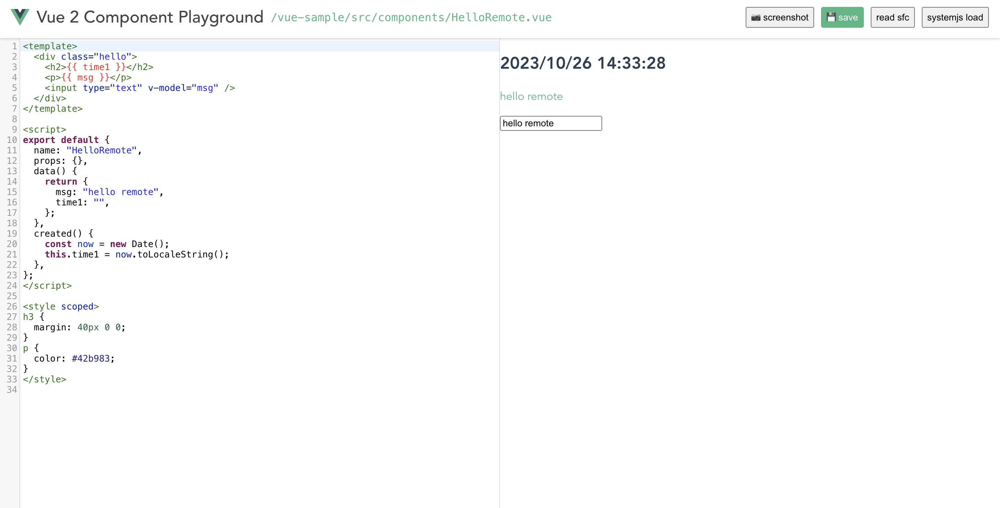
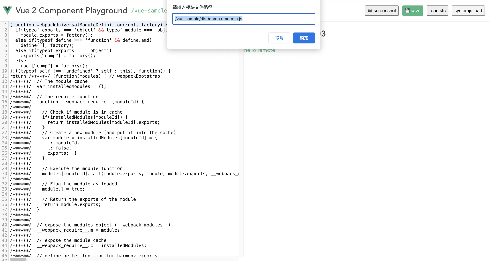

A tool for loading and rendering Vue 2.x components in real time, supporting the loading of the Single File Components (SFC) and packaged UMD modules





## npm scripts

```
npm install
```

```
npm run serve
```
